<div align="center">


<a href="#-the-problem-in-published-numbers"></a>

<br/>

<table>
<tr>
<td></td>
<td></td>
<td></td>
<td><!-- STATS:HEADER:START --><!-- STATS:HEADER:END --></td>
</tr>
<tr>
<td></td>
<td></td>
<td></td>
<td></td>
</tr>
</table>

<br/>

[](#-the-problem-in-published-numbers)
[](#-architecture)
[](#-the-pipeline)
[](#-quick-start)
[](#-roadmap)

</div>

---

> [!NOTE]
> ### 🩺 Reviewer TL;DR
> A patient is discharged Tuesday. Their urine culture returns **Thursday** showing an organism resistant to the antibiotic they went home with. The report lands in a system nobody is watching.
>
> **Nobody is negligent — there is simply no mechanism.** This *is* that mechanism: a database-enforced discharge gate, durable timers that survive a reboot, a deterministic rule engine with **zero AI on the safety path**, and a five-rung escalation ladder that ends at the patient.
>
> The AI appears **once**, behind a button, and every sentence it writes is verified against the source by plain code before a human sees it.

---

## ⚡ The idea in one diagram

```mermaid
flowchart LR
    A["🧑‍⚕️ Doctor tries<br/>to discharge"] -->|"test has no owner<br/>or no due date"| B["⛔ <b>BLOCKED</b><br/><i>discharge cannot complete</i>"]
    B --> C["✅ Owner + due date<br/>assigned"]
    C --> D["⏱️ Result now under a<br/><b>database contract</b>"]
    D --> E["🔬 Rule engine<br/>classifies it"]
    E --> F["📣 Escalation ladder<br/><b>ends at the patient</b>"]

    style B fill:#dc2626,color:#fff,stroke:#7f1d1d,stroke-width:3px
    style D fill:#0ea5e9,color:#fff,stroke:#075985,stroke-width:2px
    style E fill:#a855f7,color:#fff,stroke:#6b21a8,stroke-width:2px
    style F fill:#16a34a,color:#fff,stroke:#14532d,stroke-width:2px
```

---

<a id="-the-problem-in-published-numbers"></a>

## 📊 The problem, in published numbers

> [!IMPORTANT]
> Every figure below is from a paper we **retrieved and read**, and each is cited. **None of them describes *our* system** — they describe the problem and the category of intervention. That distinction is load-bearing and is kept everywhere in this repo.

### 🔻 Where 510 real patients actually went

<sub>**McDonald JS, Koo CW, White D, et al.** *Academic Radiology* 2017;24(3):337–344 · [PMID 27793580](https://pmc.ncbi.nlm.nih.gov/articles/PMC5309169/)</sub>

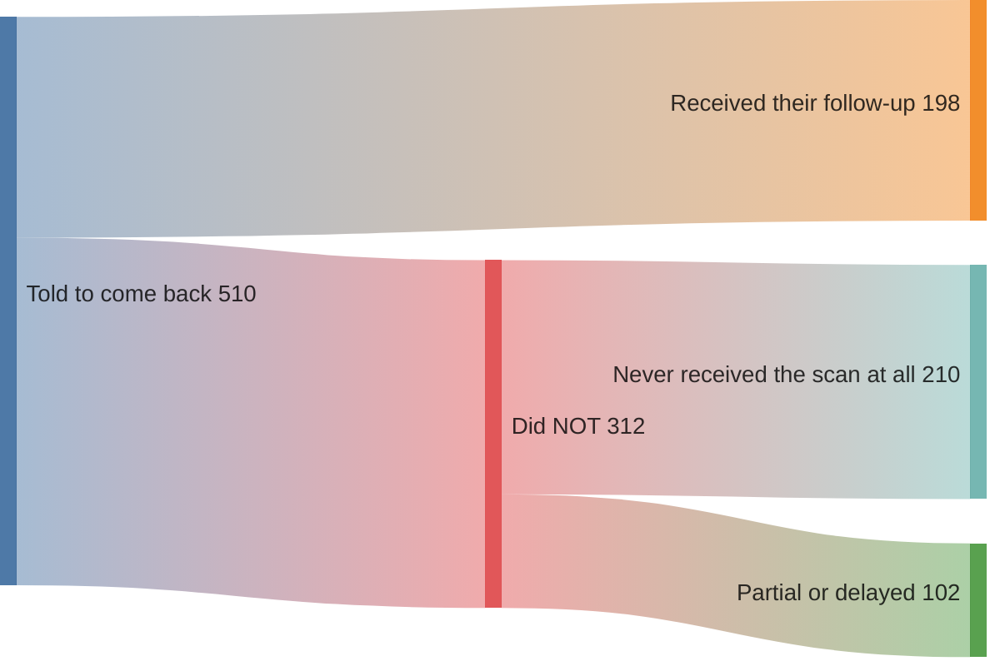

| Finding | Number |
|---|---|
| Received the recommended follow-up | **198 / 510 — 39 %** |
| Of the non-adherent, **never** received the scan at all | **210 / 312 — 67 %** |
| Adherence when the recommendation was written into the report | **31 % → 45 %** *(p = .0014)* |

> [!WARNING]
> **That `31 % → 45 %` is the ceiling of what better _reporting_ achieves.**
> It is exactly why this product **tracks** results instead of formatting them.

### 📈 A tracking programme roughly tripled follow-up — and still left half behind

<sub>**Zaki-Metias KM, MacLean JJ, Satei AM, et al.** *J Digit Imaging* 2023;36(3):804–811 · [PMID 36759382](https://pmc.ncbi.nlm.nih.gov/articles/PMC10287591/)</sub>

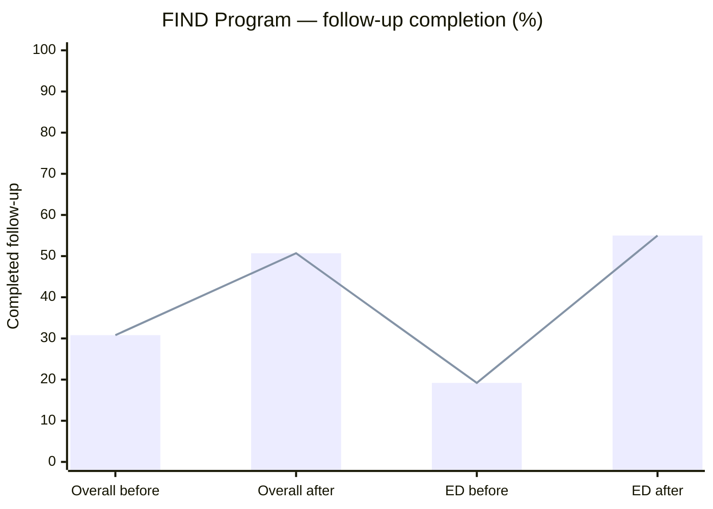

This is the closest published analogue to Result Guardian — direct evidence that **the category of intervention works.**

> [!CAUTION]
> **Even after the intervention, ~45 % of ED patients still did not complete follow-up.**
> A tracking system is a large improvement, **not a solution**. No claim of *"zero missed results"* is supportable, and **this repo makes none.**

---

## 🎯 What this changes — and what it provably does not

Most projects fill this section with an invented percentage. **This one will not**, because no clinician has ever reviewed this system's output, and an accuracy number without that is fabrication.

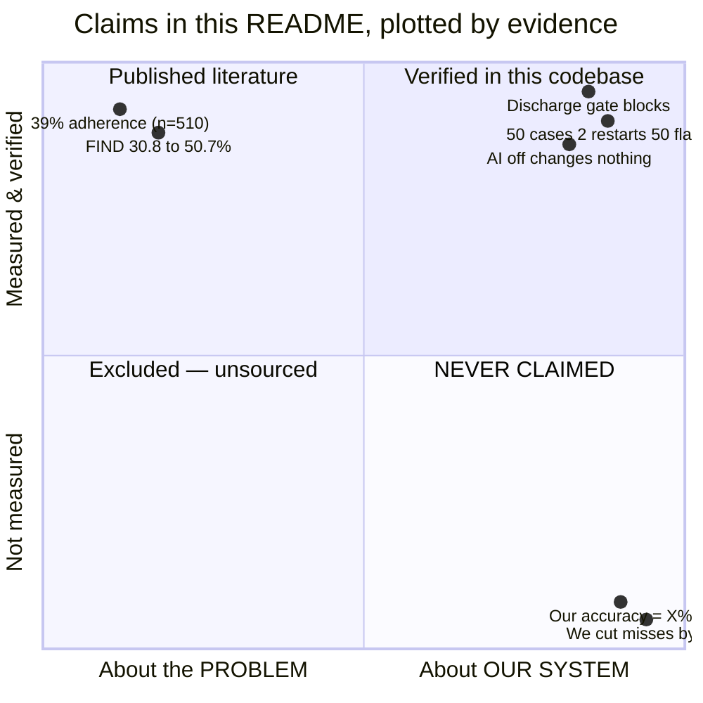

| Claim | Evidence | Status |
|---|---|---|
| The problem is real and large | McDonald 2017 — 39 % adherence, n=510 | ✅ **published, retrieved** |
| Better reporting alone is not enough | the 31 % → 45 % ceiling | ✅ **published, retrieved** |
| Tracking substantially improves follow-up | FIND — 30.8 % → 50.7 % | ✅ **published, retrieved** |
| A discharge cannot complete with an unowned test | DB constraint + E2E test | ✅ **verified in this codebase** |
| No timer is lost across a reboot | chaos test: 50 cases, 2 restarts, 50 flags | ✅ **verified in this codebase** |
| Turning the AI off changes nothing clinical | degradation test, health stays `200` | ✅ **verified in this codebase** |
| *Our* classification agrees with clinicians at **X %** | — | 🔴 **NOT MEASURED — no number exists** |
| *Our* system reduces missed results by **X %** | — | 🔴 **NOT MEASURED — no number exists** |

### 🛡️ What the design *does* guarantee by construction

Not accuracy — **asymmetry**. It is built to be wrong in the safe direction.

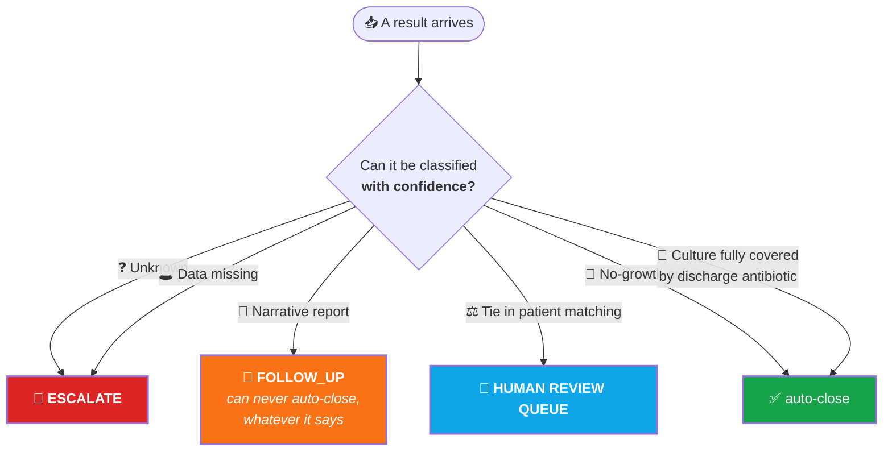

> [!TIP]
> **Exactly two paths ever auto-close.** Everything else stays with a human.

---

## ⚖️ Three rules that shape every line of this codebase

<table>
<tr>
<td width="33%" valign="top" align="center">

### 🚫🤖
### RULE 1
**Safety never depends on AI**

Tracking and escalation are database constraints and a state machine. Phases 0–5 are a complete, working product with **zero AI**.

</td>
<td width="33%" valign="top" align="center">

### 🔌
### RULE 2
**Safety never depends on the network**

Everything that keeps a patient safe runs on NODE A. Unplug the GPU box and the system loses a *convenience*, never a *guarantee*.

</td>
<td width="33%" valign="top" align="center">

### 🪜
### THE ONE RULE
**A later phase never breaks an earlier one**

Each phase degrades to the previous one — **not to silence.**

</td>
</tr>
</table>

> [!NOTE]
> These are not aspirations. **Every phase that adds a dependency ships a test that takes it away.** There is a test that switches NODE B off and asserts the flag, the timers and the escalation ladder are all untouched.

---

<a id="-architecture"></a>

## 🏗 Architecture — two machines, one job each

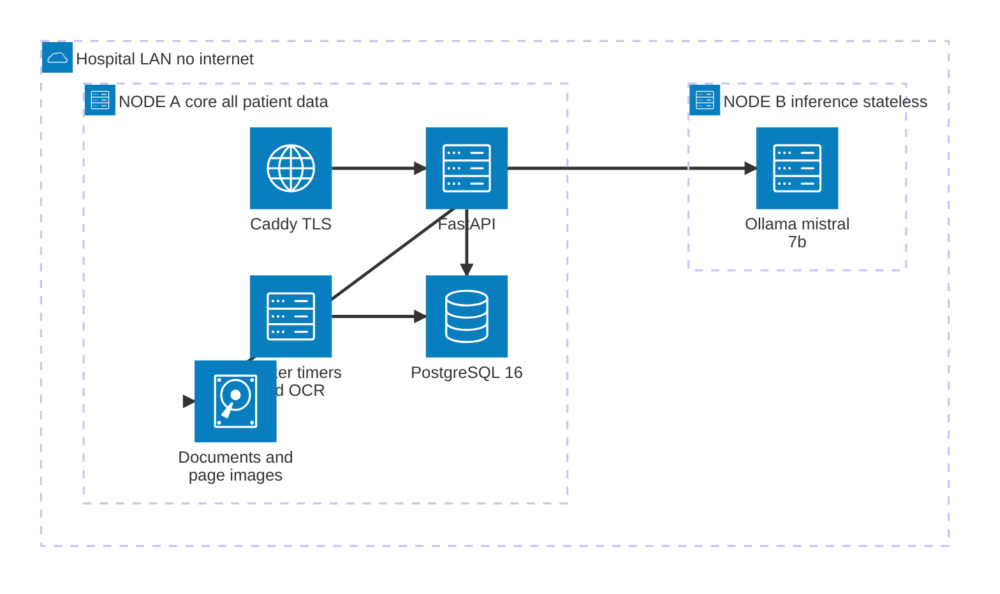

<div align="center">

**Only two things cross the wire to NODE B** — the question, and the text of the hospital's own approved guidance.
**What never does:** patient name · MRN · phone number · the PDF · any row from any patient table.

</div>

| | 🅰️ **NODE A — core** | 🅱️ **NODE B — inference** |
|---|---|---|
| **Hardware** | Any office PC, CPU only | One shared GPU box (4 GB VRAM is enough) |
| **Runs** | PostgreSQL · FastAPI · worker · Caddy · React | Ollama **only** |
| **Holds patient data** | ✅ **Yes — all of it** | ❌ **Never** |
| **If it goes down** | System is down | *Explain* degrades. **Nothing else.** |

> [!IMPORTANT]
> Turn NODE B off and the patient is still tracked, still flagged, still escalated. Only *Explain* degrades — and it degrades to **showing the retrieved guidance with no generated text**, not to silence.

<details>
<summary><b>🐘 Why one PostgreSQL instance carries everything — click to expand</b></summary>

<br/>

<div align="center">
  
</div>

<br/>

| Job | Extension | Would normally be |
|---|---|---|
| Relational data | core | PostgreSQL |
| Vectors / similarity | `pgvector` | Pinecone, Weaviate |
| Queue + timers | `pgmq` | Redis, RabbitMQ, Celery |
| Scheduled sweeps | `pg_cron` | a cron box, Airflow |
| Fuzzy text matching | `pg_trgm` · `unaccent` | Elasticsearch |
| Keyword search | `tsvector` | Elasticsearch |

**One thing to back up. One thing to restore. One transaction boundary.**

In a hospital with no dedicated ops team, that is a *safety property*, not a preference. A queue that can disagree with the database is a queue that can lose a patient's result — here they are the same transaction.

</details>

---

<a id="-the-pipeline"></a>

## 🔄 The pipeline, stage by stage

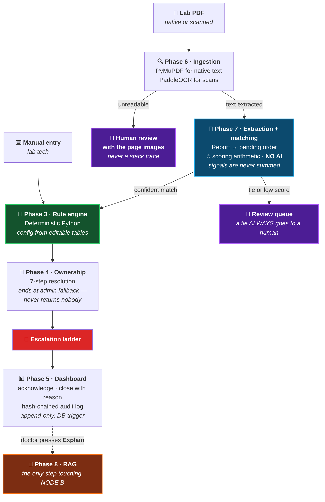

### 🔁 The case state machine

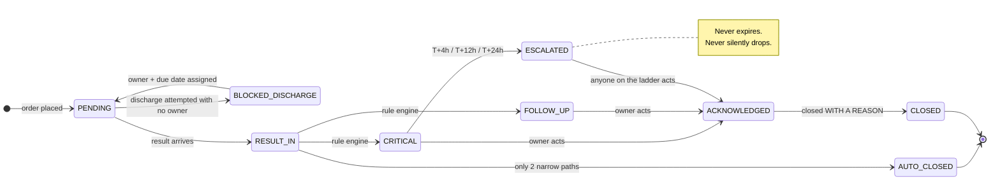

> [!TIP]
> ### ⏱️ Timers live in PostgreSQL, not only in a queue
> A `pg_cron` sweep runs **every five minutes** and re-fires anything overdue. **NODE A can reboot and nothing is lost.** There is a chaos test: **50 cases · 2 restarts mid-flight · exactly 50 flags.**

---

## 🧮 The rule engine — no AI anywhere

Three rules, all pure Python, reading configuration from **tables an admin can edit** — never constants in code.

| | Reads | Worked example |
|---|---|---|
| 🔢 **A — numeric** | the lab's own reference range + `panic_thresholds` | K⁺ **7.2** → 🔴 **critical** |
| 🧫 **B — culture** | organism · sensitivity panel · discharge medications | *E. coli* **R** to ceftriaxone, patient discharged on **Monocef** → 🔴 **critical** |
| 📝 **C — narrative** | `clinical_keywords` + negation patterns | *"suspicious for malignancy"* → 🔴 **critical** |

<details>
<summary><b>🔬 Six behaviours that are measured, not assumed — click to expand</b></summary>

<br/>

**⏳ Thresholds are time-versioned.**
When a guideline changes you add a row with a new `effective_from`. A result from last year still classifies against the threshold **in force when it was reported** — not today's.

**🔒 Auto-close is AND-across-every-rule.**
A covered culture *plus one benign microscopy line* stays **open**, because the narrative rule refuses. Any single rule can veto a close; none can force one.

**🚫 "No evidence of malignancy" is not a flag.**
The negation check is real — and deliberately built to **fail toward alerting**. Published negation detection carries a ~15 % false-negation rate, and *suppressing a real finding is the unsafe direction*. When the negation engine is unsure, the term fires anyway.

**🧪 A contaminant beats a resistance.**
4,000 CFU/mL in urine is not an infection, even if the organism is resistant to what the patient is taking. Specimen type changes the arithmetic.

**🇮🇳 Indian lakh digit grouping parses correctly.**
`1,50,000` is one hundred fifty thousand, not a parse error — and censored values (`>1000`, `<0.5`) are handled as **bounds**, not numbers.

**⚙️ Configuration lives in tables, never in code.**
Thresholds, escalation delays, keywords and synonyms are all admin-editable rows. Hardcoding any of them would turn the product back into a demo.

</details>

---

## 📣 The escalation ladder

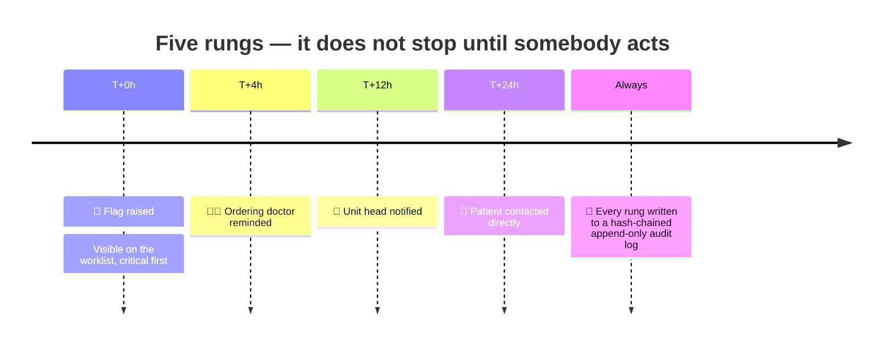

Ownership resolution runs **seven steps** and ends at an admin fallback, so it **never returns nobody**.

> [!CAUTION]
> An unowned result is the exact failure mode this product exists to prevent. The resolver is **not permitted** to reproduce it.

---

## 🤖 The AI, and its leash

Phase 8 answers one question — *"why does this matter?"* — wrapped in four constraints.

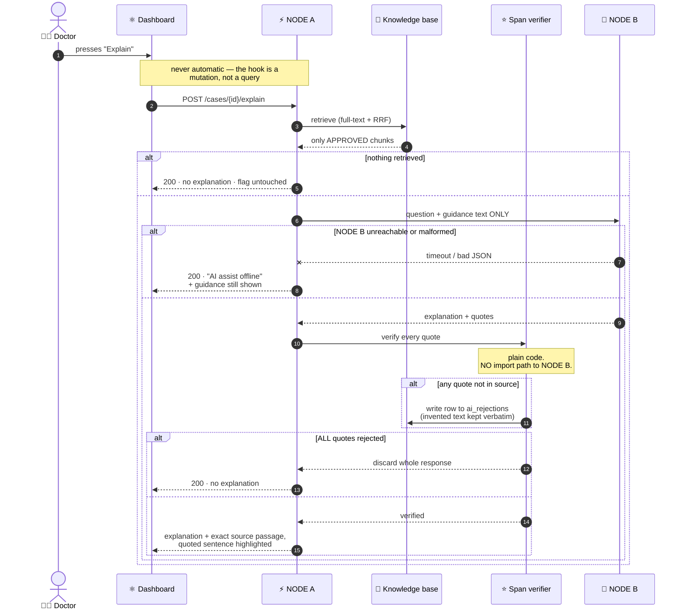

**1 · It is never asked unless a doctor asks.** No auto-run, no prefetch, no retry.

**2 · It can only quote approved guidance.** A document is invisible to retrieval until a **named person approves it**. Adding and approving are deliberately **two separate acts**.

**3 · ⭐ Every quotation is verified by plain code before anyone sees it.** The span verifier has **no import path to NODE B at all** — *a guard implemented with the thing it guards against is not a guard*. Rejections are written to `ai_rejections`, so the hallucination rate is **countable**.

**4 · Failure is always silence, never a wrong answer.** Four paths return no explanation. Each says which, each returns `200`, and **none touches the flag**.

> [!CAUTION]
> ### 💥 Why the verifier exists — a measured example, not a fear
> Asked *"what is a critical potassium level?"*, a live model answered **"6.0 mEq/L or higher"** — fluent, confident, and **from no source this system holds.** The verifier exists for that sentence.

---

## ✅ What is actually built — honest status

> [!NOTE]
> This project treats **"written"** and **"done"** as different words. A phase is ✅ only when it has **actually run**.

| Phase | Status | Exit gate |
|---|---|---|
| `0` Foundation | ✅ done | ✅ **passed** |
| `1` Data model + ⭐ **discharge gate** | ✅ done | ✅ **passed** |
| `2` Durable timers | ✅ done | ✅ **passed** |
| `3` Clinical rule engine | 🛑 code done + audited | 🔴 **open — needs a clinician** |
| `4` Ownership + escalation ⭐ | ✅ done + audited | ✅ **passed** |
| `5` Dashboard, closure, audit ⭐ | ✅ done + audited | 🔴 open |
| `6` Document ingestion (PDF/OCR) | ✅ done, run end to end | 🔴 open |
| `7` Extraction + matching | 🔵 code done | 🔴 cannot close |
| `8` RAG explanation | 🔵 built, run end to end | 🔴 cannot close |
| `9` Hospital integration (HL7/FHIR) | 🔴 not started | ⬜ |
| `10` Security + production | ⬜ not started | ⬜ |

<div align="center">

<!-- STATS:START -->
   
<!-- STATS:END -->

</div>

> [!TIP]
> ### ⚙️ Those four numbers are not typed by hand
> They are **counted out of the repository on every push to `main`** by
> [`scripts/update_readme_stats.py`](scripts/update_readme_stats.py), run from
> [`.github/workflows/readme-stats.yml`](.github/workflows/readme-stats.yml).
>
> A README that claims a test count is making a claim. **This one measures it** —
> and if somebody deletes a hundred tests, the badge goes down on the next push
> without anyone remembering to edit it. *Same rule as everywhere else in this
> repo: a number nobody measured is a number nobody should trust.*
>
> **The badge deliberately reads lower than `pytest` does.** It counts *test
> functions written*; pytest counts *cases executed*, and one
> `@pytest.mark.parametrize` expands into many. Both are true — the badge takes
> the conservative one, so this README can never overstate its own coverage.

### ⛔ The honest caveats, stated plainly

> [!CAUTION]
> **No clinician has ever reviewed the rule engine's output.** Exit Gate 3 requires ≥ 95 % agreement with a clinician and **there is no agreement rate at all.** *Nobody should describe this system's accuracy with a number.*

> [!WARNING]
> **Every panic threshold in the database is a development placeholder**, marked `source = 'DEVELOPMENT PLACEHOLDER - NOT A CLINICAL SOURCE'`. They are plausible numbers, **not any hospital's**. Replacing them is one conversation with a lab.

> [!WARNING]
> **The knowledge base contains one fabricated demo document**, labelled as such in its title, its `source_ref` **and** its publisher. No WHO, ICMR, antibiogram or NLEM content is loaded.

---

<a id="-quick-start"></a>

## 🚀 Quick start

 **Nothing else.**

```bash
git clone https://github.com/AshmitThakur23/result-guardian.git
cd result-guardian
cp .env.example .env
#  edit .env: POSTGRES_PASSWORD, RG_JWT_SECRET, RG_LLM_BASE_URL
docker compose up -d --build
docker compose exec api alembic upgrade head
curl http://localhost/api/health
```

> [!IMPORTANT]
> The migrate step is **not optional** — the schema, including the worker's heartbeat table, is owned by Alembic.

<details>
<summary><b>🌱 Seed it — and the trap that will bite you</b></summary>

<br/>

```bash
docker compose exec -T api python scripts/reset_dev_passwords.py
docker compose exec -T api python -m scripts.seed_rules_dev
docker compose exec -T api python scripts/seed_dev.py
docker compose exec -T api python scripts/seed_kb_demo.py
```

**⚠️ Run all four again after any `pytest` run.**

`test_migration_round_trip` downgrades and re-upgrades, which **drops and recreates the tables** — including `panic_thresholds`, `antibiotic_synonyms`, `clinical_keywords` and `mdro_rules`.

The rule engine then runs with **no thresholds and no synonyms, silently**: cultures come back `follow_up` instead of `critical` because "Monocef" no longer maps to ceftriaxone, and nothing warns you.

**This has bitten us; it will bite you.**

</details>

Then open **http://localhost** — password for every account is `ResultGuardian#2026`.

| Code | Role | Start here for |
|---|---|---|
| `DOC1` | 👨‍⚕️ doctor | Worklist, cases, the Explain panel |
| `ADMIN1` | 🛠️ admin | Everything, plus **Guidance** (the knowledge base) |
| `LAB1` | 🔬 lab_tech | Documents — PDF upload and the review queue |
| `HEAD1` | 👔 unit_head | The above plus Reports |
| `AUDIT1` | 🕵️ auditor | Audit trail, read-only |

---

## 🎬 Walk the demo

The story is far more convincing in this order.

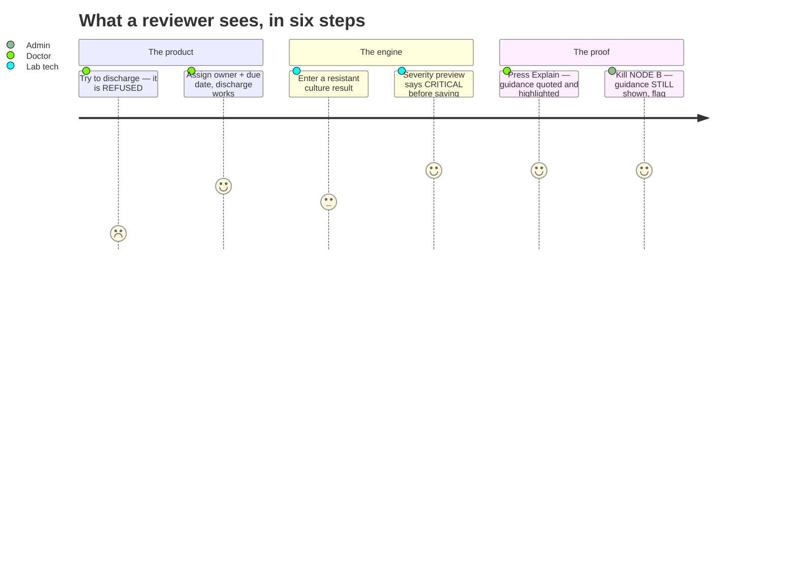

**1 · ⛔ The gate refuses a discharge.** Open a patient with an outstanding investigation and try to discharge them. It is refused, **in words**, with the blocking orders named. ***This is the product.***

**2 · ✅ Assign and discharge.** Give each blocking order a responsible doctor and an expected-by date. Now discharge succeeds — and the result is **under contract**.

**3 · 🧫 Enter the result the lab would send.** Organism `Escherichia coli` · count `>100,000 CFU/mL` · specimen `urine` · antibiotic `Ceftriaxone` → **R**.

Watch the severity preview **before you save**. It says *Critical*, and names the discharge antibiotic it conflicts with. **That is the rule engine, not AI.**

**4 · 🚩 The worklist flags it.** Critical first, then oldest. The row carries a colour, a coloured rail, an icon shape **and** a word — four channels, so it survives greyscale, a projector, and colour-blindness.

**5 · 💡 Ask why it matters.** Open the case, press **Explain**. ~15 s. You get a short explanation, and under it **the exact passage of hospital guidance it came from, with the quoted sentence highlighted inside it.**

**6 · ⭐ Now break it on purpose.** As `ADMIN1`, turn NODE B off with the kill switch. Press <kbd>Explain</kbd> again.

> [!TIP]
> You get *"The AI assist is offline"* — **and the approved guidance is still shown underneath**, because retrieval never left NODE A. The flag, the timers and the escalation ladder are all untouched.
>
> ### That is RULE 2, on screen, in one click.

---

## 🧪 Testing

```bash
docker compose exec -T api python -m pytest   # 1171 backend cases
cd web && npx vitest run                      # 187 frontend tests
cd web && npx playwright test                 # 53 end-to-end, real stack
```

The E2E suite runs against the **real** Caddy, the real API and the real Postgres with its real constraints. **Nothing is mocked.**

> [!NOTE]
> **`1171` here and `1221` on the badge count different things, and both are right.**
> pytest reports **cases executed** — one parametrised test expands into many. The
> badge counts **test functions written**, across backend *and* frontend *and* E2E.
> Neither is the other's error; the README says which is which rather than picking
> the bigger number.

<details>
<summary><b>📏 Four conventions this repo actually enforces — and the bugs that earned them</b></summary>

<br/>

**🔴 A test that has never failed is not a test.**
Any test guarding a defect is made to fail on purpose first — revert the fix, watch it go red, restore it. *This caught an RBAC test that passed while **31 endpoints were reachable with no credential at all**, because it inspected the router's dependency graph and router-level dependencies attach at `include_router` time. Rewritten black-box against the live OpenAPI schema, it finally went red.*

**🔢 Check the exit code, never the last line.**
`ruff check .` ends with *"No fixes available (4 hidden fixes…)"*, which reads like success **while it is reporting five errors**. A `| tail -1` showed only that line, and two commits went onto a red CI because of it. Now: `cmd >/dev/null 2>&1; echo "exit=$?"`.

**🪜 Degradation is tested, not intended.**
Every phase that adds a dependency ships a test that removes it. Writing *"it degrades gracefully"* in a docstring is a design intention; the test is the only thing that makes it true and keeps it true after the next refactor.

**📐 `jsdom` performs no layout**, so unit tests cannot see a broken table.
`e2e/layout.spec.ts` measures real geometry at six viewports in both themes; `e2e/contrast.spec.ts` measures WCAG contrast on rendered pages. Both assert a **minimum number of elements measured**, so a broken selector fails loudly instead of reporting a confident green over nothing.

</details>

---

## 📱 On a phone

 

A thin **Capacitor** shell that loads the live dashboard from NODE A over the LAN — nothing to rebuild on the web side when the UI changes, and **no patient data is ever stored on the device.**

```bash
adb connect <phone-ip>:<port>
adb install -r web/android/app/build/outputs/apk/debug/app-debug.apk
```

Point `server.url` in `web/capacitor.config.ts` at NODE A. If NODE A's DHCP lease moves, that file must change and the APK must be rebuilt.

> [!WARNING]
> `ping` to NODE A may report **100 % loss while the app works perfectly** — ICMP is blocked on a "Public" Wi-Fi profile, but TCP/80 passes. **Don't trust ping.**

---

## ❌ What is NOT built

> [!IMPORTANT]
> Named here so nobody mistakes any of it for working.

| | Reality |
|---|---|
| 📵 **Notifications** | **No notification can leave the building.** `SmsAdapter` and `SmtpAdapter` are written but **never registered**, and there are no provider settings. Every email and SMS rung silently degrades to in-app. **The T+24h patient SMS cannot reach a patient.** |
| 🌐 **Hindi / Punjabi** | Partial. Only the patient-facing template is genuinely translated; six other localised files still contain English. |
| 🔎 **Semantic search** | Not built. Retrieval is Postgres full-text fused through RRF. `bge-m3` embeddings and the reranker named in the architecture are **not installed**, so `kb_chunks.embedding` is always `NULL`. A recorded, deliberate deviation — ranking is worse, guidance does not disappear. |
| 🏷️ **LOINC** | **0 rows.** The mapping cascade is written, wired and indexed; the release is a registration-gated download. |
| 🔌 **FHIR R4** | `fhir` is only a value in an enum. That is Phase 9. |
| 🔁 **Re-assignment** | Ownership does not re-assign after rung 0. Reminders follow the duty roster, but the dashboard keeps showing the original owner. |

---

<a id="-roadmap"></a>

## 🔭 Roadmap

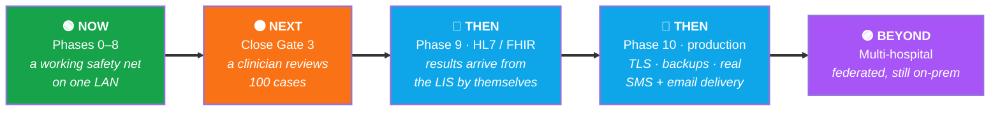

### 🔑 The two things that unlock everything else

Neither is an engineering problem. **Both are one conversation away.**

1. **A clinician reviews 100 cases.** That closes Exit Gate 3 and turns *"we think it classifies correctly"* into a measured agreement rate **with a confidence bound**. Until then, this system has no accuracy number and will not claim one.
2. **A hospital lab shares its ISO 15189 critical-value list.** That replaces every `DEVELOPMENT PLACEHOLDER` threshold with the institution's real ones. The research found there is **no national or international consensus list** — every hospital sets its own, so this *must* come from the deploying site.

### 🧭 Where the architecture is already pointed

| | |
|---|---|
| 🔌 **HL7 v2 / FHIR R4** | The enum value exists; the contract is specified in [`docs/integration-spec.md`](docs/integration-spec.md). **Results stop being typed in.** |
| 🧠 **Semantic retrieval** | `kb_chunks.embedding` and `pgvector` are **already in the schema**. Installing `bge-m3` is a drop-in with **no code change**. |
| 📨 **Real delivery** | The adapters are written; they need provider settings and a registration line, **not a rewrite**. |
| 🌐 **Federation** | Every node is self-contained and holds its own data, so multiple hospitals can run independently and share **guidance, never patients**. |

> [!NOTE]
> ### 🎲 The deliberate design bet
> Everything above is **additive**. Each one can fail, be delayed, or be refused by a hospital's IT department — **and the discharge gate still works.** *That is THE ONE RULE, applied to the roadmap.*

---

## 🗺️ Repo map

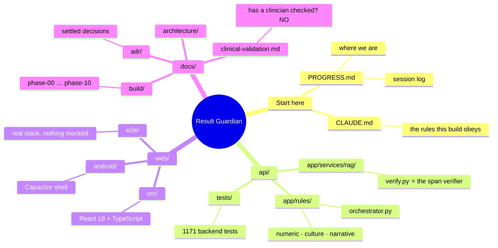

| Path | What |
|---|---|
| [`PROGRESS.md`](PROGRESS.md) | **Where we are.** Session log and phase status — *start here* |
| [`CLAUDE.md`](CLAUDE.md) | The rules this build is held to |
| [`docs/build/`](docs/build/) | Phase-by-phase plan, `phase-00` … `phase-10` |
| [`docs/architecture/`](docs/architecture/) | What happens at runtime |
| [`docs/adr/`](docs/adr/) | Settled decisions, with reasoning |
| [`docs/clinical-rule-research-findings.md`](docs/clinical-rule-research-findings.md) | The published literature behind the rules |
| [`docs/clinical-validation.md`](docs/clinical-validation.md) | **Has a clinician checked the rule engine?** *(no)* |
| `api/app/rules/` | The rule engine — start at `orchestrator.py` |
| `api/app/services/rag/verify.py` | The span verifier ⭐ |
| `web/e2e/` | End-to-end tests against the real stack |

---

## 🛠️ Stack

<div align="center">

   

   

   

</div>

---

## 📜 License

  

**Copyright © 2026 Ashmit Thakur. All rights reserved.**
Portions contributed by Abhinendra Singh Chauhan and Piyush Dhami.

See [`LICENSE`](LICENSE) for the full terms. In short:

| ✅ Permitted | ❌ Not permitted |
|---|---|
| View and download for **personal learning** | Use in any personal, academic or commercial project |
| **Fork** this repository on GitHub | **Sell it, host it as a service, or charge for it** |
| Open **issues, suggestions and pull requests** | **Copy any feature, workflow, schema or screen into your own product** — *including rewriting it in another language* |
| | Publish, distribute or re-upload (whole or in part) |
| | Create derivative or *"inspired-by"* reimplementations |
| | **Use this repo as training data** for any model |
| | Claim this code as your own work |

### 💼 Want to use it? Talk to us first.

> [!IMPORTANT]
> **Result Guardian is an original product, and it is available for commercial licensing.**
> It is published here so it can be **reviewed**, not so it can be **taken**.
>
> If you want to use this — in a hospital, a product, a startup, or a client
> project — that is a conversation we want to have, and it must happen
> **before you build**. Commercial terms, pilot deployments and integration work
> are all negotiable.
>
> 📧 **[ashmitthakur615@gmail.com](mailto:ashmitthakur615@gmail.com)** — Ashmit Thakur, copyright holder. *Preferred route.*
> 📬 Or **[open an issue](https://github.com/AshmitThakur23/result-guardian/issues)** — though that thread is visible to everyone, and pricing and pilot terms usually shouldn't be.
>
> **Silence is not a licence.** Without written permission from the copyright
> holder, you do not have permission.

> [!CAUTION]
> ### 🚑 This is not a medical device — and that is not boilerplate
> **It must not be used to make, inform, or delay any clinical decision.** The
> `LICENSE` file states exactly why, and every reason is verifiable from this
> repository:
>
> - **No clinician has ever reviewed its output** — there is no agreement rate, no
>   sensitivity, no specificity. *Anyone quoting an accuracy figure is quoting a
>   number that does not exist.*
> - **Every clinical threshold is a development placeholder**, marked as one in the
>   data itself.
> - **No notification can leave the building** — the final escalation rung
>   **cannot reach a patient**.
> - **No CDSCO, FDA or EU MDR assessment** has been made or sought.
>
> The restriction on clinical deployment exists for **patient safety, not
> commercial reasons**, and it is the one the authors care about most.

<sub>Third-party dependencies (PostgreSQL, FastAPI, React, Ollama, PaddleOCR and everything in `pyproject.toml` / `package.json`) remain under **their own licenses**, unaffected by this file.</sub>

---

<div align="center">

## Built to be wrong in the safe direction.

**Unknown escalates. Missing data escalates. A tie goes to a human.**
**Only two narrow paths ever auto-close.**

<br/>


</div>
